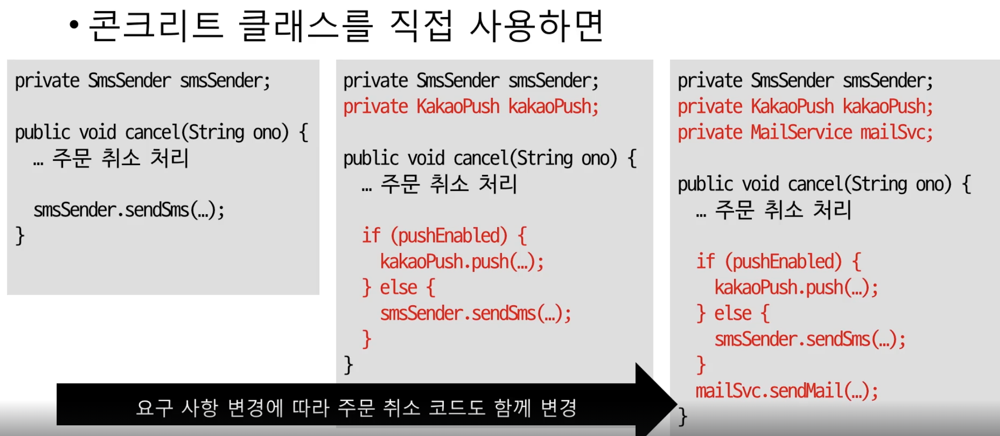
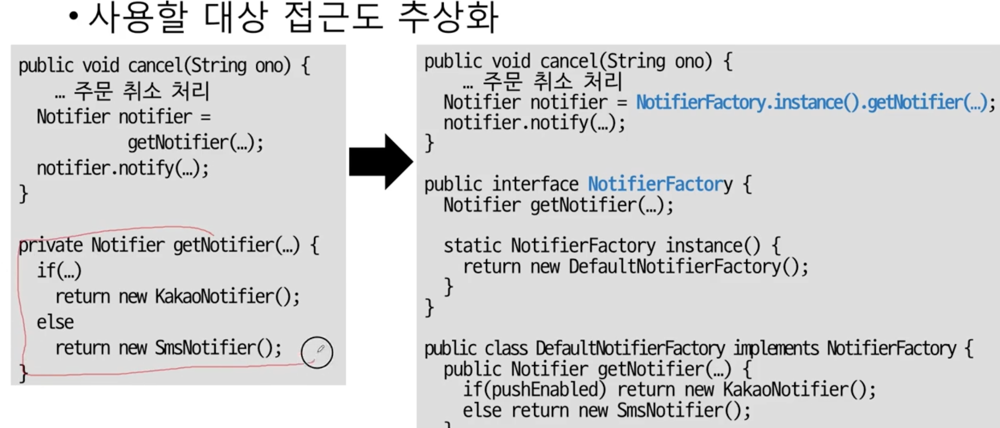

## 비용
출시를 거듭할 때마다 코드 줄 수 추가에 따른 비용이 기하급수적으로 늘어난다.  
-> 코드 분석 시간 / 코드 변경 시간이 증가하기 때문  
  
소프트웨어의 가치는 변하는 데에 있는 것임.  
근데 여기서 그냥 "keep it working like before"하게 유지하는 게 아니라,  
"keep being useful in a changing world"해야 함.  
  
결국 개발에서의 핵심은 낮은 비용으로 변화할 수 있게 만드는 것이다.  
이를 위해 여러 패러다임과 아키텍처를 이용하는 것이다.  
  
캡슐화와 다형성(추상화)가 이 비용을 낮추는 데 큰 도움이 된다.  
  
  
## 객체  
절차 지향은 하나의 데이터를 여러 프로시저가 공유하는 방식이다.  
절차 지향은 당시에는 코딩하기 쉽지만, 시간이 지날수록 유지보수를 아주 어렵게 만든다.  
점점 여러 군데를 동시에 고치고, 같은 코드를 복붙해서 사용하게 됨.  
  
객체는 데이터와 프로시저를 묶는다.  
그리고 객체 간에는 데이터를 주고 받을 수 없고, 프로시저를 호출하는 방식으로 연결된다(캡슐화).  
  
객체에 데이터와 프로시저가 포함되긴 하지만,  
사용자 입장에서는 그 세부사항을 모르고 그 기능만 알고 있으면 된다(그렇게 만들어야 한다).  
그렇다면 사용자는 그 기능을 어떻게 사용할 수 있는지 알아야 하는데, 그게 바로 기능 명세이다(보통 메소드로 정의).  
객체와 객체는 기능을 사용함으로써 연결된다(= 메시지를 주고 받는다 = 메소드를 호출하고 리턴받는다).  
  
**객체의 핵심은 기능이다. 객체는 기능으로 정의한다!!**  
  
  
## 캡슐화  
캡슐화 == 데이터와 데이터 관련 기능을 묶는 행위    
객체가 기능을 어떻게 구현했는지 상세한 정보를 외부로부터 감추는 것(정보 은닉)  
-> 이런 캡슐화를 통해 외부에 영향을 안 주고 내부 로직을 변경할 수 있음  
   
요구 사항이 바뀌면 데이터를 사용하는 방법(로직)에 변화가 생긴다.  
ex. 원래는 정회원만 쓸 수 있는 기능이었는데, 준회원도 포함시키게 됨 -> 정회원 기능을 검증하는 로직이 바뀜  
-> 만약 if 문으로 그때그때 분기처리한 게 아니라, 권한 여부를 반환하는 해당 객체의 메소드를 이용했다면 그 메소드만 바꾸면 됨  
  
캡슐화 기능: 기능에 대한 의도를 이해할 수 있다, 캡슐화는 의도를 몰라서는 코딩할 수 없기 때문에 캡슐화 자체가 기능의 의도를 이해할 수 있게 만들어줌  
  
원칙  
1. Tell, Don't ask: 데이터를 달라 하지 말고 해달라고 하기. 데이터에 직접 접근하지 말고 원하는 결과만 달라고 부탁하자(판단까지 부탁하자). 혹은 특정 값을 할당하는 로직도 부탁해서 해결할 수 있게 하자.   
2. Demeter's Law: 객체의 메서드 하나만 호출하자. 점 두개가 나오면 안 된다. 주입 받은 객체의 속성이나 메소드에 더해 추가적인 작업을 해야한다면 그 객체에 그 추가적인 작업을 처리하는 메소드를 추가하여 그 메소드 하나를 호출하는 식으로 해라.  
   
  
### 다형성과 추상화
캡슐화와 더불어 객체지향에서 가장 중요한 게 추상화임.  
다형성은 말 그대로 여러 모습을 갖는 것이다.  
하나의 객체가 여러 타입의 기능을 제공할 수 있다. (상속 받으면 부모의 기능까지 사용 가능하므로)

추상화는 데이터나 프로세스 등을 하나의 공통점으로 묶어 특정한 개념이나 표현을 도출해내는 것.  
추상화는 특정한/공통된 성질을 뽑아내서 할 수 있다.  
서로 다른 기능들 간에 공통된 성질을 발견하면 그것들을 하나의 개념으로 추상화할 수 있다.(ex. 카카오톡 발송기, sms 발송기, 이메일 발송기를 발송기라는 공통점으로 묶어 추상화)  

**예시**
[카카오, 이메일 발송 추가]  
추상화를 이용하여 다형성 있게 구현 시 "구체적으로 어떤 발송기인지는 몰라도 그 발송기의 notify라는 기능을 이용할 것이다."라는 식의 열린 구현이 가능해짐.  
이것이 어떻게 도움이 되는지 구체적으로 얘기하겠다.  
예를 들어 sms로만 발송하다가, 상황에 따라 카카오톡, 이메일 발송도 하려고 한다.  
이때 만약 추상화를 통해 다형성 있게 구현하지 않았다면, if문을 추가해서 경우를 나눠, 조건을 확인하는 부분과 메시지를 발송하는 부분을 추가해야 한다.(그리고 이 사항을 문자 발송이 있는 모든 곳에서 똑같이 반영해줘야 한다.)  
하지만 만약 발송기를 추상화하고, 발송기를 만드는 factory 단까지 추상화해놨다면, 그 factory의 getNotifer 부분만 분기처리 해서 고쳐주면 된다.  
그럼 문자를 발송하는 부분의 로직은 건드리지 않고, notifier를 만드는 메소드만 수정하면 나머지는 자동으로 반영이 된다.  
 
 

[플랫폼 별 클라우드 파일 처리]  
추상화하지 않은 구현에선 플랫폼 별로 로직이 유사하지만 조금씩 달라, 플랫폼 별로 분기처리하여 각 플랫폼에 맞는 로직을 전부 작성해주어야 한다.  
플랫폼이 하나 추가될 때마다 모든 관련 메소드가 있는 곳마다 if 블록을 추가해야 한다.  
많은 if문은 코드를 읽을 때 결과 예측을 어렵게 함.  
특정 플랫폼에 대한 코드를 수정하고 싶을 때 해당 코드를 찾기 어려움.  
  
모든 플랫폼의 로직을 "클라우드 파일 시스템", "클라우드 파일 시스템 팩토리", "클라우드 파일"으로 추상화한다.  
이제부턴 플랫폼에 상관없이 일정한 형태의 메소드로 소통하기 때문에 외부로 드러나는 로직이 간단 명료해짐.  
"클라우드 파일 시스템 팩토리", "클라우드 파일" 클래스를 상속받아 플랫폼 별로 concrete 메소드만 구현해주면 됨.(각 플랫폼 별 세부 내용만 채워주면 됨)   
  
**OCP(Open-Closed principle):** 기능의 확장에는 열려 있고 코드 수정에는 닫혀있음. 즉 구체적인 코드를 수정하지 않고도 기능을 확장할 수 있는 상태. 예를 들면 파일을 처리하는 파일 시스템은 고정이 되어있고, 그 시스템에 들어가는 파일의 종류를 늘림으로써 기능 확장이 가능한 구조. 이렇게 되면 파일 시스템은 수정할 필요없으면서(closed) 파일의 종류를 늘려 기능을 확장할 수 있다(open).  
    
### 상속보단 조립
### 기능과 책임 분리
### 의존과 DI